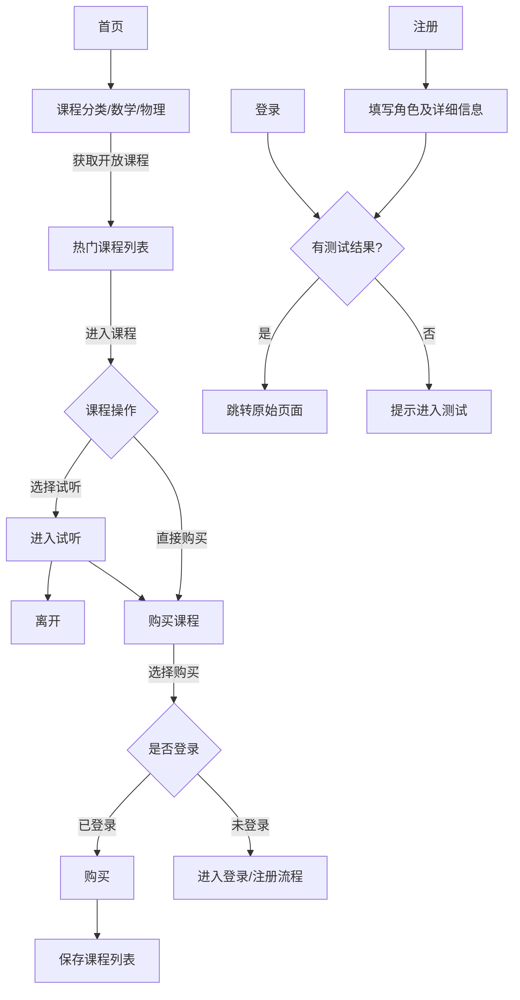

# 学生流程

```mermaid

graph TD

I[首页] --> A
A[课程分类/数学/物理] -->|获取开放课程| B[热门课程列表]
B -->|进入课程| C{课程操作}
C -->|选择试听|D[进入试听]
D --> 离开
C --> |直接购买|J
D --> J[购买课程]
J -->|选择购买|E{是否登录}
E --> |已登录|F[购买]
E --> |未登录|G[进入登录/注册流程]
F --> H[保存课程列表]

L[登录] --> O
M[注册] --> N[填写角色及详细信息]
N --> O{有测试结果?}
O --> |是|Q[跳转原始页面]
O --> |否|P[提示进入测试] 

```