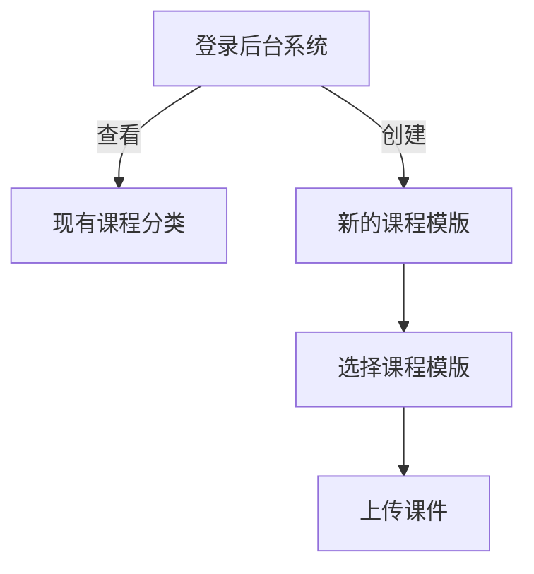
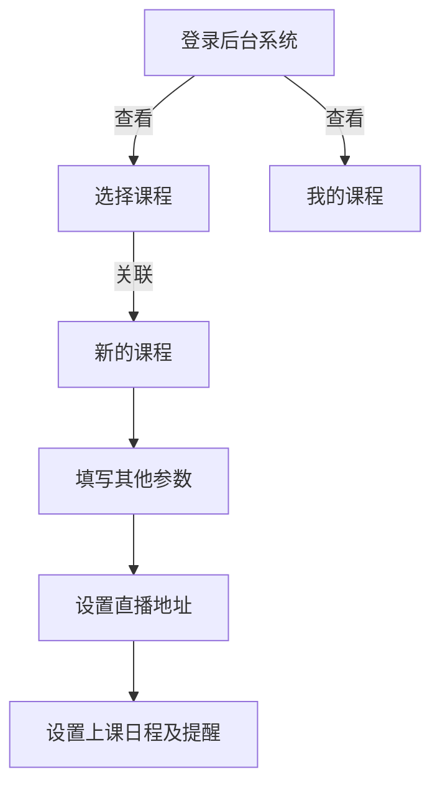

# 授课流程

## 教材准备流程

```mermaid
graph TD

A[登录后台系统] -->|查看| B[现有课程分类 ]
A[登录后台系统] -->|创建| C[新的课程模版]
C --> D[选择课程模版]
D --> E[上传课件]

```

## 授课流程

```mermaid
graph TD

A[登录后台系统] -->|查看| B[现有课程分类 ]
B[选择课程] -->|关联| C[新的课程]
C --> D[填写其他参数]
D --> E[设置直播地址]
E --> F[设置上课日程及提醒]
A[登录后台系统] -->|查看| G[我的课程 ]

```